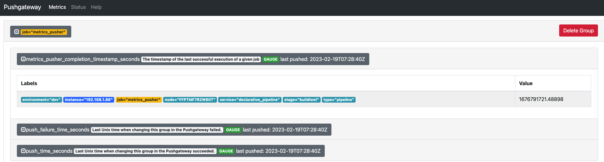

# metricspusher
Generic Prometheus Pushgateway client for ephemeral jobs and applications

## Usage

```
$ ./metricspusher
Generic Prometheus Pushgateway client for ephemeral jobs and applications

Usage:
  metricspusher [command]

Available Commands:
  completion  Generate the autocompletion script for the specified shell
  help        Help about any command
  list        Prints list of metrics currently supported
  push        Push metrics to a target Prometheus Pushgateway
  version     Prints version information

Flags:
  -h, --help     help for metricspusher
  -t, --toggle   Help message for toggle

Use "metricspusher [command] --help" for more information about a command.
```

For pushing a metric to Pushgateway:

```bash
$ ./metricspusher push --metric gaugetimestamp --start --stage buildtest --type pipeline
{"level":"info","msg":"pushed gaugetimestamp for service cicd_pipeline",
    "time":"2023-02-19 07:32:11"}
```

In case of success, you should it on Pushgateway UI, as per below:

 


For deleting a metric from Pushgateway:

```bash
$ ./metricspusher push --metric gaugetimestamp --stop --stage buildtest --type pipeline
{"level":"info","msg":"removed gaugetimestamp for service cicd_pipeline",
    "time":"2023-02-19 07:33:10"}
```

You may also trigger a metric to be pushed and removed after a given interval of seconds with a single command, using 
the `--for` flag -- just take consideration your Prometheus scrapping interval so that the data is not lost:


```bash
$ ./metricspusher push --metric gaugetimestamp --for 15 --stage buildtest --type pipeline
{"level":"info","msg":"pushed gaugetimestamp for service cicd_pipeline",
    "time":"2023-02-19 07:32:11"}
```

## Build

For building a container image:

```bash
make build
```

For local development, start a Prometheus Pushgateway locally on port `9091` and build the binary with the following:

```bash
$ make setup
b5945c06772a49771c63fb692403cebb0f70f76b92d2cc97b4929ed69806a033
$ make local-build
successfully build on ./bin/metricspusher
$ ./bin/metricspusher version
1.0.1
```
To stop and remove the Pushgateway container, run the following:

```bash
make destroy
```